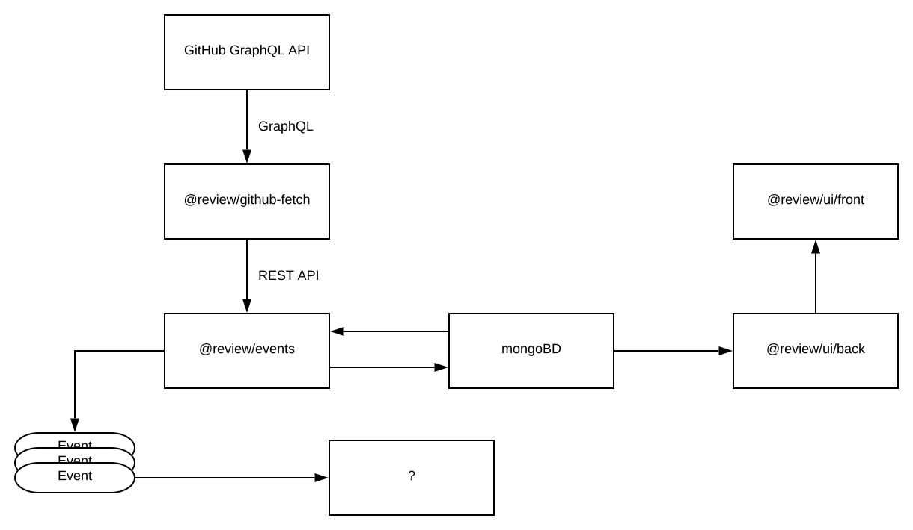

# Review

Для локальной разработки:

1. Добавьте в /etc/hosts
    ```
    127.0.0.1 events
    127.0.0.1 mongodb
    ```
2. Сконфигурируйте [@review/github-fetch](github-fetch/README.md)
2. Запустите mongodb - `yarn mongodb`
3. Запустите @review/events - `yarn events`
4. Запустите @review/github-fetch - `yarn github-fetch`

**Важен порядок**

---

### Архитектура

`mongodb` - используется для хранения данных
`@review/github-fetch` - сервис ходит в GitHub и отправляет данные в `@review/events`
`@review/events` - сервис сравнивает хранимые в `mongodb` данные с полученными от `@review/github-fetch` и генерирует события для других сервисов



---

Временные записи: 

Реакции:
1) После открытия пулл-реквеста написать ревьюверам, если они есть
    1.1) Если пулл-реквест долго не ревьювят писать автору и ревьюверам, если они есть
2) Если пришел запрос изменений или комментарии написать автору 
3) После получения апрува написать мерджеру и автору

TODO:
- Add github project with tasks:
    - [@review/github-fetch] Add to query more data, research
    - [@review/events] Store data into mongodb
    - [@review/events] Read data from mongodb
    - [@review/events] Add data comparison, generate events architecture (TODO: decompose this task)
    - [@review/slackbot] Add boilerplate for module
